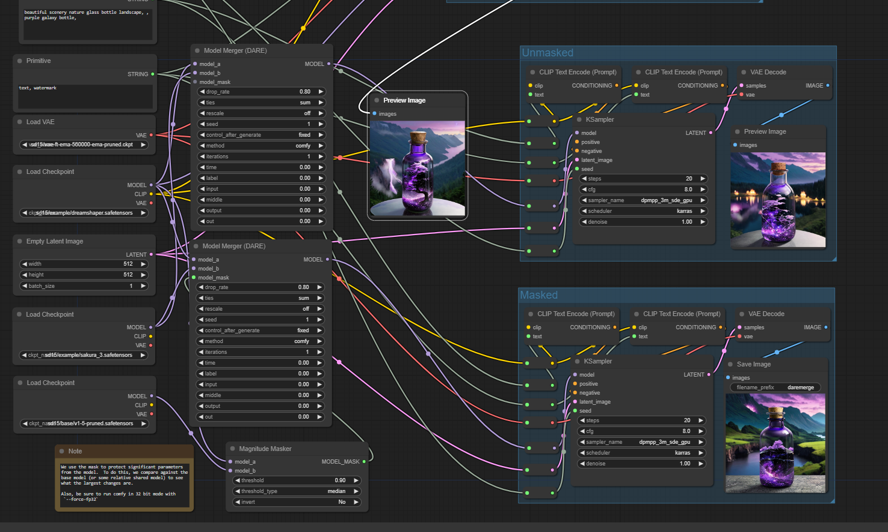
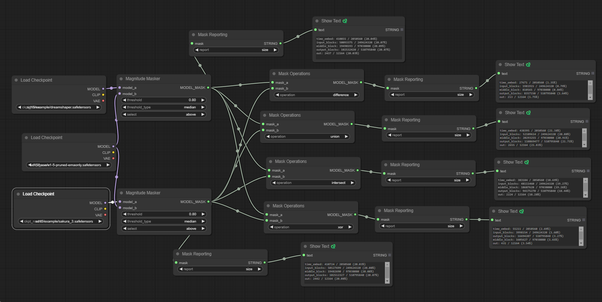

# Examples

Some of the images in this directory have embedded workflows:
Workflows:

* `daremerge.png` - The above DARE merge workflow

* `maskedmerge.png` - The masked merge workflow, which shows the difference of just using just the mask merge instead of the DARE merge

## Masking
You can see the basic mask operations below:

