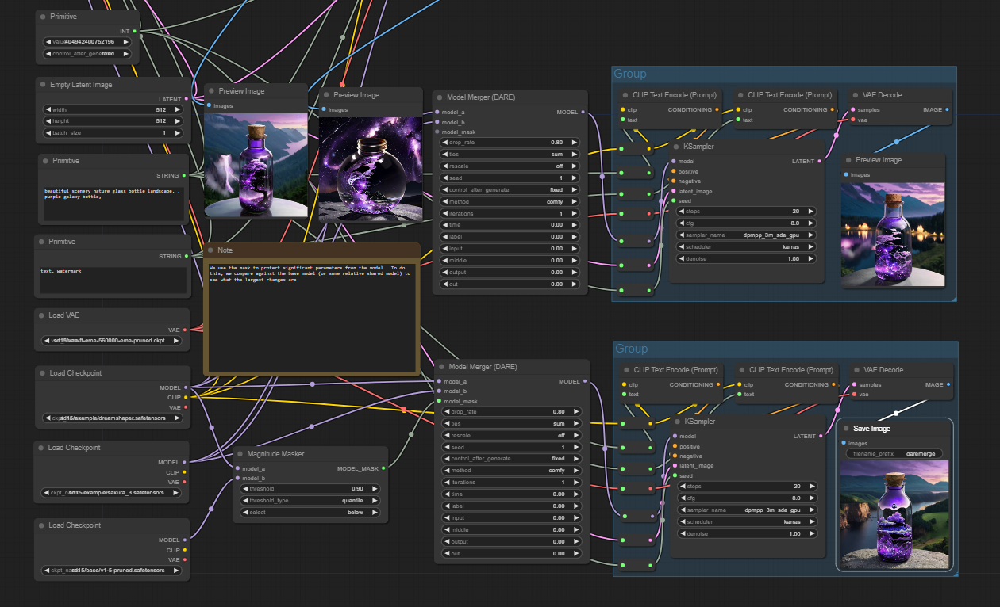

# Examples

Some of the images in this directory have embedded workflows:
*these are outdated and will be updated soon*
Workflows:

* `daremerge.png` - The above DARE merge workflow

* `maskedmerge.png` - The masked merge workflow, which shows the difference of just using just the mask merge instead of the DARE merge

## Masking
You can see the basic mask operations below:

More advanced features are in development if you want to try them out:

## Reporting
Not really super useful to most, but you can also dump out plots of the model layers themselves:
